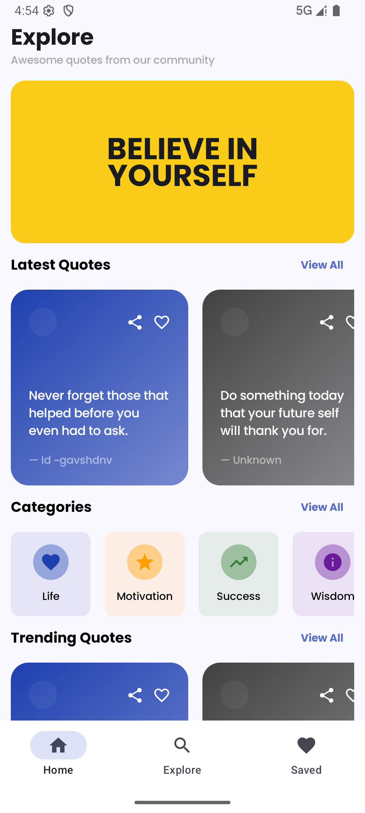
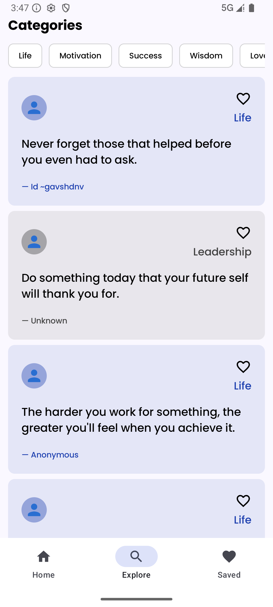
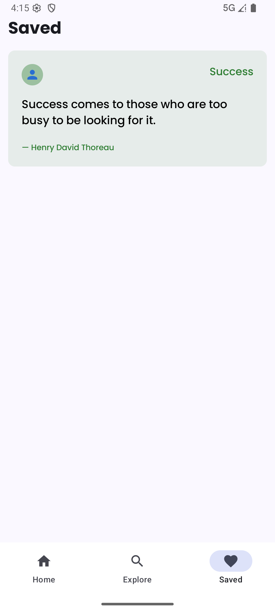

# Quotes App 📖

A learning project to practice Android development with Jetpack Compose. This app displays inspirational quotes across multiple categories, allowing users to save favorites and explore quotes by category. Built as part of learning modern Android development practices.

## ✨ Features

- **Home Screen**: Browse latest quotes, trending quotes, and explore categories
- **Explore Screen**: Filter quotes by category (Life, Motivation, Success, Wisdom, Love, Courage, Leadership)
- **Saved Screen**: View all your favorite saved quotes in one place
- **Save Quotes**: Tap the heart icon on any quote to save it to your favorites
- **Beautiful UI**: Modern Material Design 3 with gradient cards and smooth animations
- **Category Filtering**: Easily filter quotes by category using interactive chips
- **Bottom Navigation**: Seamless navigation between Home, Explore, and Saved screens

## 🛠️ Tech Stack

- **Language**: Kotlin
- **UI Framework**: Jetpack Compose
- **Architecture**: MVVM-ready structure
- **Navigation**: Jetpack Navigation Compose
- **Material Design**: Material 3
- **Minimum SDK**: 24 (Android 7.0)
- **Target SDK**: 36
- **Compile SDK**: 36

## 📦 Dependencies

- Jetpack Compose BOM (2024.09.00)
- Material 3
- Navigation Compose (2.9.6)
- Lifecycle Runtime KTX
- Activity Compose

## 🏗️ Project Structure

```
app/src/main/java/com/example/quotes/
├── domain/
│   └── model/
│       ├── Category.kt          # Category data models and enums
│       └── Quote.kt             # Quote data model and sample data
├── navigation/
│   ├── BottomNavigationBar.kt   # Bottom navigation bar component
│   ├── NavigationItem.kt         # Navigation items configuration
│   └── QuotesScreenRoute.kt     # Navigation routes
├── presentation/
│   ├── SavedQuotesState.kt       # State management for saved quotes
│   ├── QuotesAppNavGraph.kt     # Navigation graph setup
│   ├── components/
│   │   ├── CategoryCard.kt       # Category card component
│   │   ├── ExploreQuoteCard.kt   # Quote card for explore screen
│   │   └── QuoteCard.kt          # Quote card component with favorite
│   └── screens/
│       ├── HomeScreen.kt         # Home screen with latest/trending quotes
│       ├── ExploreScreen.kt      # Explore screen with category filtering
│       └── SavedScreen.kt        # Saved quotes screen
├── ui/
│   └── theme/
│       ├── Color.kt              # Color definitions
│       ├── Theme.kt              # App theme configuration
│       └── Type.kt               # Typography definitions
└── MainActivity.kt               # Main activity entry point
```

## 🚀 Getting Started

### Installation

1. **Clone the repository**
   ```bash
   git clone <repository-url>
   cd Quotes
   ```

2. **Open in Android Studio**
   - Open Android Studio
   - Select "Open an Existing Project"
   - Navigate to the cloned directory

3. **Sync Gradle**
   - Android Studio will automatically sync Gradle dependencies
   - Wait for the sync to complete

4. **Run the app**
   - Connect an Android device or start an emulator
   - Click the "Run" button or press `Shift + F10`
   - Select your target device

### Building the Project

```bash
# Build debug APK
./gradlew assembleDebug

# Build release APK
./gradlew assembleRelease

# Install on connected device
./gradlew installDebug
```

## 📸 Screenshots

<!--  -->
<!--  -->
<!--  -->


## 📱 Screens

### Home Screen
- Displays a motivational banner
- Shows latest quotes in a horizontal scrollable list
- Displays categories for quick navigation
- Shows trending quotes
- Each quote card has share and favorite buttons

### Explore Screen
- Category filter chips at the top
- Filter quotes by category (Life, Motivation, Success, Wisdom, Love, Courage, Leadership)
- Vertical list of quotes matching the selected category
- Beautiful card design with category-specific colors

### Saved Screen
- Lists all saved/favorite quotes
- Empty state message when no quotes are saved
- Easy access to all your favorite quotes

## 🎨 Design Features

- **Gradient Cards**: Beautiful gradient backgrounds on quote cards
- **Category Colors**: Each category has its own color scheme
- **Material Design 3**: Modern UI following Material Design guidelines
- **Smooth Animations**: Fluid transitions between screens
- **Responsive Layout**: Adapts to different screen sizes

## 💾 State Management

The app uses a simple state holder pattern (`SavedQuotesState`) to manage saved quotes:
- Saves quote IDs in a state set
- Provides methods to check if a quote is saved
- Toggles save/unsave functionality
- Automatically updates UI when quotes are saved/unsaved

## 🔄 Navigation

The app uses Jetpack Navigation Compose with:
- Bottom navigation bar for main screens
- Deep linking support for category filtering
- State preservation during navigation
- Proper back stack management

## 📚 Learning Objectives

This project was built to learn and practice:
- **Jetpack Compose**: Modern declarative UI framework
- **Navigation Compose**: Screen navigation and deep linking
- **State Management**: Managing app state with Compose
- **Material Design 3**: Implementing modern Material Design
- **Kotlin**: Modern Android development with Kotlin
- **Component Architecture**: Building reusable UI components
- **Lazy Lists**: Efficient list rendering with LazyColumn and LazyRow

## 📝 Code Style

- Follows Kotlin coding conventions
- Uses Jetpack Compose best practices
- Clean architecture principles
- Separation of concerns (domain, presentation, UI)

---

**Built with ❤️ using Jetpack Compose - A Learning Project**

